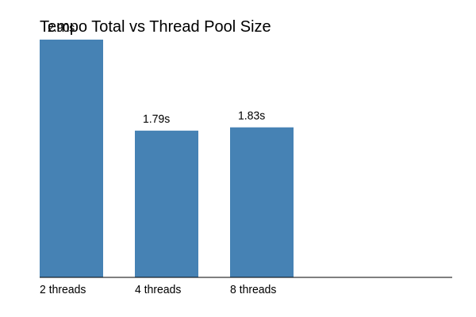

# 🔧 Node.js Thread Pool Benchmark

This project demonstrates how Node.js handles heavy tasks using the internal **libuv thread pool**, even though it's single-threaded at its core. It benchmarks how different thread pool sizes (`UV_THREADPOOL_SIZE`) affect total execution time using the `crypto.pbkdf2` function.

## 📈 What does it show?

Node.js uses a **thread pool behind the scenes** to offload expensive operations (I/O, crypto, compression, etc). This benchmark simulates a CPU-heavy task using `crypto.pbkdf2` to show how concurrent workloads are distributed across available threads.

## 📂 Project Structure

```
.
├── main.js       # Runs the benchmark
├── plot.js            # Generates a graph from the results
├── results.csv        # Stores benchmark results (auto-generated)
├── Dockerfile         # Containerized setup
├── Makefile           # Shortcut to run with different thread sizes
└── README.md          # You're here
```

## 🚀 How to Run

### 1. Build Docker image

```bash
docker build -t threadpool-benchmark .

# makefile
make build
```

### 2. Run with different thread pool sizes

```bash
make run THREADS=2
make run THREADS=4
make run THREADS=8
```

Each run appends a line like `4,1.82` (threads,time) to `results.csv`.

### 3. Generate the chart

```bash
node plot.js
```

This generates a file named `result.png`, showing execution time vs thread pool size.

## 📊 Benchmark chart result


## 💻 Example Output

```
🧵 UV_THREADPOOL_SIZE = 4
🚀 Firing 10 tasks with pbkdf2...

✅ Task 1 finished in 0.63s
✅ Task 2 finished in 0.64s
...
🏁 All tasks concluded in 1.82s

📦 Saved in results.csv: [4,1.82]
```

## 📦 Docker Volume Tip

If you're running this in Docker and want to **persist `results.csv`**, mount the current folder:

```bash
docker run --rm -e UV_THREADPOOL_SIZE=4 -v $(pwd):/app threadpool-benchmark
```

## 🧠 Takeaway

This benchmark visually proves how the thread pool offloads work in parallel — reducing total execution time without blocking the Node.js main thread.

---

Made with 🧵 by @Artur